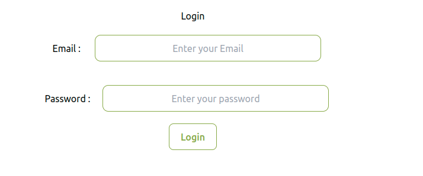
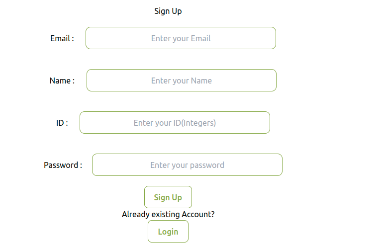
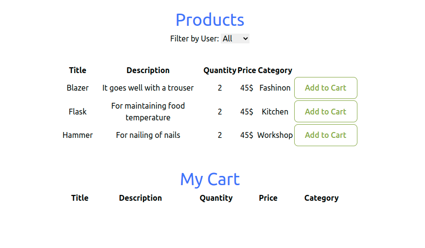
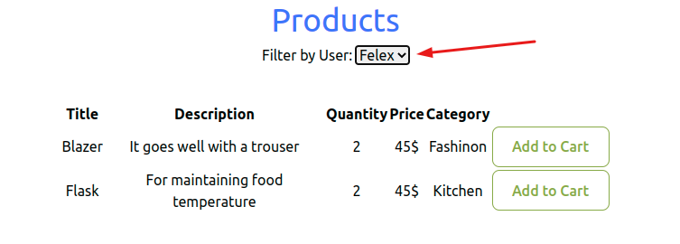
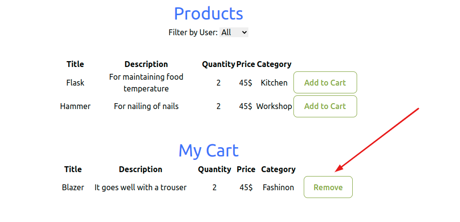

# Product Management Repository

This is a Product Management system to add and delete products

## Instructions on how to set up locally
 ### Clone the project
  - Clone the project using the command `git clone git@github.com:felexkemboi/iquantilellc.git`
  - In the root directory of the project(in command line), install the packages using `npm install`
  - After installing the necessary packages,fire up the local server using the command `npm run dev`
  - Copy the url given and open it with your favorite browser. Example `http://localhost:5173/`
  - You can see the home page? Good work, you are good to go!
  
 ### Instructions on how to use the app
 - This is the landing page where you can sign up or login(example of user credentials in store)
  
 
 - This is the Login Page
  
 
 - This is the Sign Up Page
  

 - This is the products page where one can view the available products
  

 - Filter functionality where one can filter products per user
  

 - Add to cart, note a user can add/remove items from a cart
  